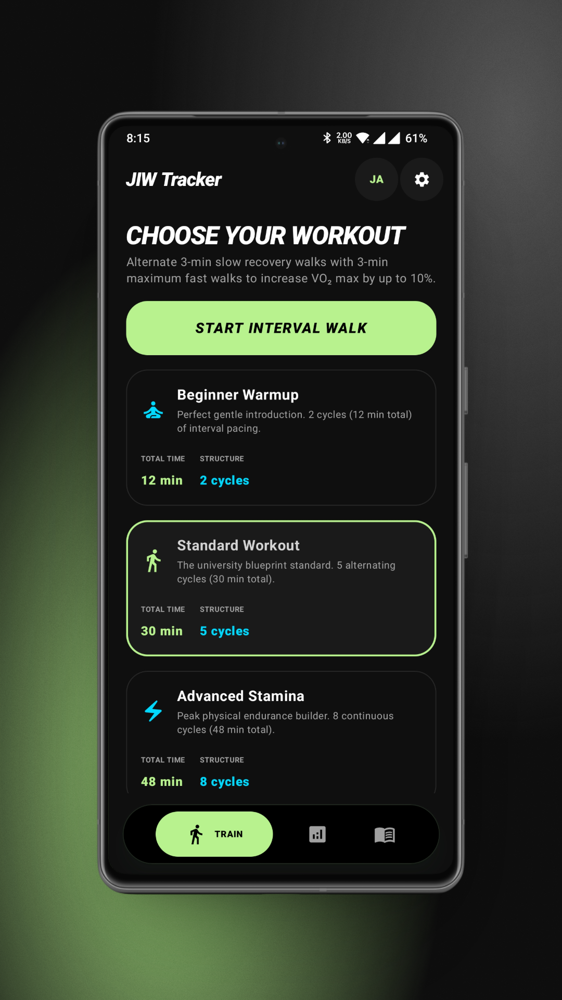
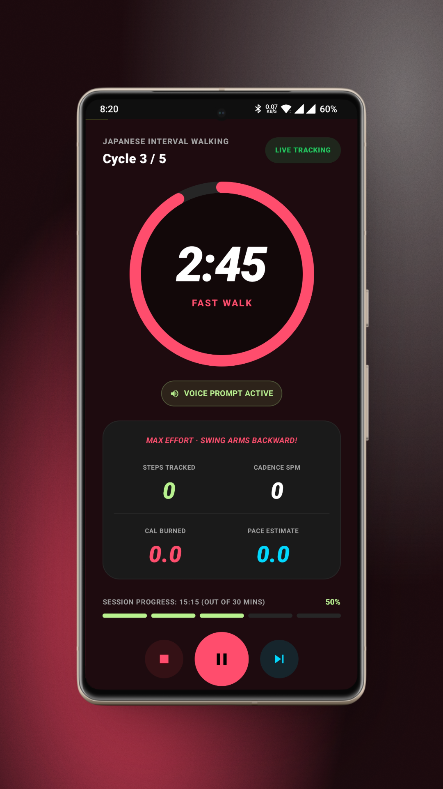
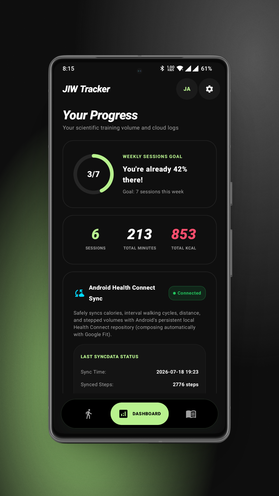
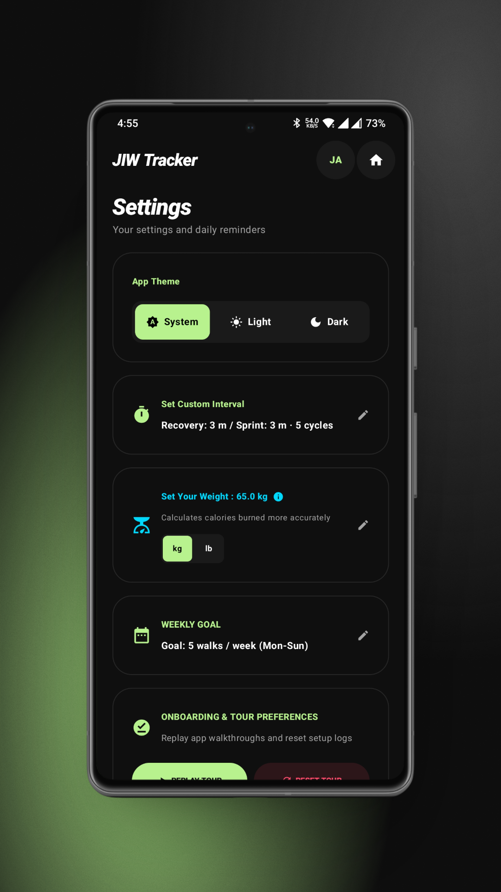
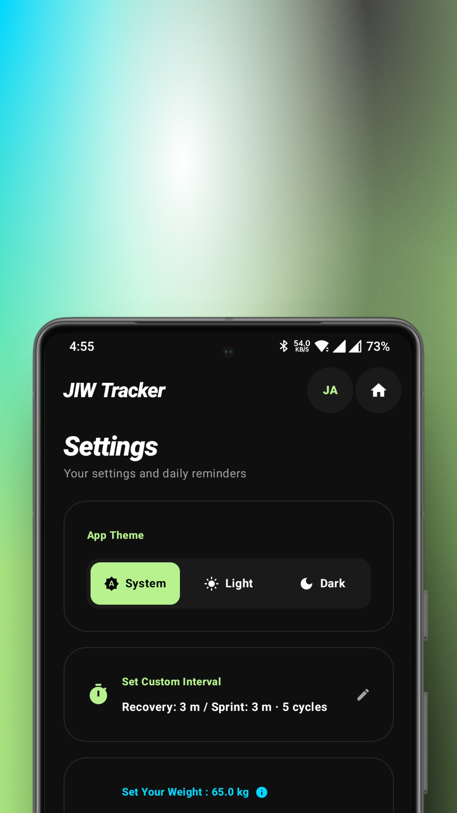
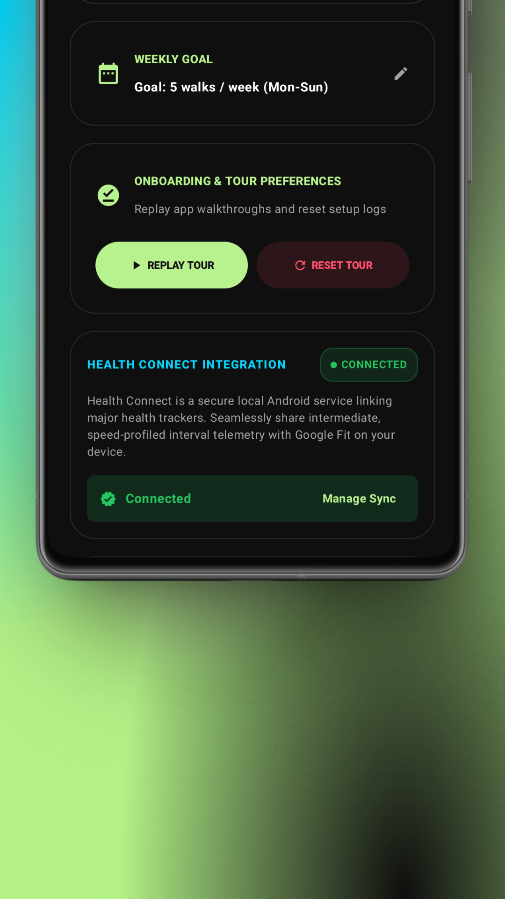

<h1>JIW Tracker</h1>
<h3>Precision fitness tracking for the Shinshu University interval-walking method.</h3>

<h2>🧭 What is this?</h2>

<table align="center" width="100%">
<tr valign="middle">
<td width="60%" align="left">

Researchers at <a href="https://www.shinshu-u.ac.jp/">Shinshu University (信州大学)</a> demonstrated that alternating between a brisk walk and an easy stroll — in precisely timed intervals — produces measurable metabolic benefits beyond steady-pace walking.

<b>JIW Tracker</b> puts that protocol into your pocket: you define the interval profile, and the app guides you through each segment in real time with live calorie tracking based on your body metrics and walking speed. Every session syncs to Android Health Connect so your walking data lives alongside the rest of your health ecosystem.

<blockquote>
<b>🚶 Walk smarter, not just longer — with JIW Tracker.</b>
</blockquote>
</td>
<td width="40%" align="center">

🔬 <b>Metabolic Calorie Engine</b> <small>Calories computed from real walking speed and personal body metrics, not generic estimates.</small>

🩺 <b>Health Connect Sync</b> <small>One-tap sync of sessions, calories, and steps into your unified Android health record.</small>

🎛️ <b>Interval Profile Scheduling</b> <small>Define fast-walk and easy-stroll durations that match the Shinshu protocol exactly.</small>

</td>
</tr>
</table>

<h2>📸 Screenshots</h2>

<table align="center">
<tr valign="top">
<td align="center">
<b>Choose Your Workout</b>  

</td>
<td align="center">
<b>Live Session</b>  

</td>
<td align="center">
<b>Dashboard</b>  

</td>
</tr>
</table>

More screenshots

<table align="center">
<tr valign="top">
<td align="center">
<b>Settings</b>  

</td>
<td align="center">
<b>Theme Toggle</b>  

</td>
<td align="center">
<b>Health Connect</b>  

</td>
</tr>
</table>

<h2>✨ Features</h2>

<table align="center" width="100%">
<tr valign="top">
<td width="50%">
<h3>🔬 Tracking & Science</h3>
<ul>
<li><b>Interval Profile Scheduling:</b> Define fast-walk and easy-stroll durations that match the Shinshu protocol, then let the app guide you segment by segment.</li>
<li><b>Metabolic Calorie Engine:</b> Calories are calculated from actual walking speed and your personal body metrics, not generic per-minute estimates.</li>
<li><b>Segmented Session HUD:</b> A live, animated heads-up display progresses through each interval so you always know which phase you're in and what's next.</li>
</ul>
</td>
<td width="50%">
<h3>🩺 Health Connect</h3>
<ul>
<li><b>One-Tap Sync:</b> Walking sessions, calories burned, and step data flow directly into your unified Android Health Connect record.</li>
<li><b>Ecosystem Friendly:</b> Sits alongside apps like Google Fit and Samsung Health without duplicate entry.</li>
</ul>
</td>
</tr>
<tr valign="top">
<td width="50%">
<h3>🎨 UX & Personalization</h3>
<ul>
<li><b>Interactive Onboarding Wizard:</b> Collects your body weight and weekly walking goals on first launch so calorie math is accurate from session one.</li>
<li><b>kg / lb Unit Toggle:</b> Works in whichever system you prefer, with instant conversion.</li>
<li><b>Dark & Light Themes:</b> Choose between <i>CarbonBlack</i> (dark) and <i>MinimalLight</i> (light) to match your environment.</li>
</ul>
</td>
<td width="50%">
<h3>📝 Consumer-Friendly Copy</h3>
<ul>
<li><b>Human-Written Labels:</b> Every label and prompt is written for the person using it, not the engineer who built it.</li>
</ul>
</td>
</tr>
</table>

 

<table border="0" cellpadding="15" cellspacing="0" width="85%">
<tr>
<td align="center">
<h3>💖 Support the Project</h3>

If JIW Tracker helps you stick to your walking routine and you'd like to support ongoing development, consider buying me a coffee. Every bit helps keep the app maintained, ad-free, and growing.

 

</td>
</tr>
</table>

 

<h2>🚀 Getting Started</h2>

<h3>Prerequisites</h3>

<table align="center">
<tr>
<th>Requirement</th>
<th>Details</th>
</tr>
<tr>
<td><b>Android Studio</b></td>
<td>Latest stable recommended</td>
</tr>
<tr>
<td><b>JDK</b></td>
<td>17 (bundled with recent Android Studio)</td>
</tr>
<tr>
<td><b>Min SDK</b></td>
<td>26 (Android 8.0 Oreo)</td>
</tr>
<tr>
<td><b>Target SDK</b></td>
<td>36</td>
</tr>
</table>

<h3>Build</h3>

<pre><code># Clone the repository
git clone https://github.com/premkumar-1122/Japanese-Interval-Walking.git
cd Japanese-Interval-Walking

# Build the standard flavor (includes Google Play Services Location)
./gradlew assembleStandardDebug

# Or build the F-Droid–compatible flavor (no proprietary dependencies)
./gradlew assembleFdroidDebug
</code></pre>

The signed release build and distribution bundle are produced automatically by CI — see <a href="#-releases">Releases</a> below.

<h2>📦 Releases</h2>

JIW Tracker uses a <b>tag-triggered GitHub Actions pipeline</b> (<code>.github/workflows/release.yml</code>). Pushing a <code>vX.Y.Z</code> tag to <code>main</code> automatically:

<ol>
<li>Checks out the code and sets up JDK 17</li>
<li>Decodes the signing keystore from a sealed GitHub secret</li>
<li>Builds a <b>signed APK</b> and <b>AAB</b> via Gradle</li>
<li>Generates release notes from conventional commits</li>
<li>Creates a GitHub Release with both artifacts attached</li>
</ol>

The project has shipped <b>7 releases</b>, the latest being <b>v2.1.2</b>.

<table align="center">
<tr>
<th>Resource</th>
<th>What it covers</th>
</tr>
<tr>
<td><a href="docs/CI-CD.md"><code>docs/CI-CD.md</code></a></td>
<td>Full pipeline architecture and required secrets</td>
</tr>
<tr>
<td><a href="SKILL.md"><code>SKILL.md</code></a></td>
<td>Step-by-step release runbook for maintainers</td>
</tr>
<tr>
<td><a href="CHANGELOG.md"><code>CHANGELOG.md</code></a></td>
<td>Detailed per-version changelog</td>
</tr>
</table>

<h2>🤝 Contributing</h2>

JIW Tracker started as a personal project and has grown into something I'm proud to share. Whether you want to fix a typo, add a new feature, improve localization, or tighten the calorie model — your contribution is welcome.

<ol>
<li>Fork the repository</li>
<li>Create a feature branch (<code>git checkout -b feature/your-idea</code>)</li>
<li>Commit with <a href="https://www.conventionalcommits.org/">conventional commit</a> messages</li>
<li>Open a Pull Request</li>
</ol>

No CLA, no bureaucracy — just good code and thoughtful design.

<table border="0" cellpadding="15" cellspacing="0" width="85%">
<tr>
<td align="center">
<h3>💬 Community & Support</h3>

Have a question, found a bug, or want to talk walking science? Come say hi.

 

  

<a href="https://github.com/premkumar-1122/Japanese-Interval-Walking/issues">🐞 Report Bugs</a> &nbsp;•&nbsp;
<a href="https://github.com/premkumar-1122/Japanese-Interval-Walking/discussions">💬 Discussions</a> &nbsp;•&nbsp;
<a href="https://github.com/premkumar-1122/Japanese-Interval-Walking/releases">🚀 Releases</a>

</td>
</tr>
</table>

<h2>📄 License</h2>

This project is released under the <a href="LICENSE">GNU General Public License v3.0</a>.

<strong>Made with ❤️ for anyone chasing a healthier stride</strong>

⭐ Star this repo if JIW Tracker helps your walks!

